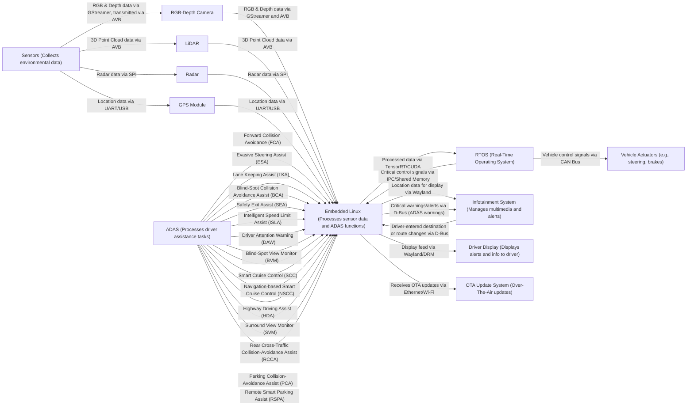

# Automotive Embedded Systems and Custom Linux Architectures

## Table of Contents

- Introduction to Custom Linux in Automotive Systems
- Hardware and Software in Autonomous Vehicles
  - Tesla FSD
  - Google Waymo
  - Samsung Tizen
- Use of Yocto in Automotive Systems
  - Overview of Yocto
  - Yocto in Tesla, Waymo, and Samsung
  - Hardware Acceleration with Jetson Nano and Yocto
  - Yocto for Custom Linux in Infotainment and Vision Systems
- System Architecture and Performance Considerations
  - Real-Time OS (RTOS) and Embedded Linux
  - Display Systems and Video Processing
  - Separate Systems for Vision Processing and Infotainment
- Practical Examples and Case Studies
  - Nvidia Jetson Platform in Automotive Systems
  - Yocto-Based Build Systems
- Conclusion

---

## Introduction to Custom Linux in Automotive Systems

In modern automotive systems, especially those with autonomous driving capabilities, companies like Tesla, Google Waymo, and Samsung utilize custom Linux distributions. These systems are tailored for specific functions like vision processing for autonomous driving and infotainment. Custom Linux enables these companies to optimize for performance, security, and real-time processing.

---

## Hardware and Software in Autonomous Vehicles

### Tesla FSD

**Tesla's Full-Self Driving (FSD) computer** uses a custom Linux-based operating system optimized for autonomous driving tasks. Initially, Tesla's system ran on Nvidia hardware, but more recently, they have developed their AI chips to handle vision processing, AI inference, and autonomous decision-making. Tesla's FSD system runs an exclusive software stack based on Linux but is highly customized for real-time performance, focusing on self-driving and AI tasks.

### Google Waymo

Google's Waymo also relies on a custom Linux system to power its autonomous vehicles. Waymo's system processes data from sensors like cameras, LiDAR, and radar using high-performance hardware, typically Nvidia GPUs. Like Tesla, Waymo’s system doesn’t display a typical Linux desktop interface but shows a highly optimized UI for autonomous driving feedback.

### Samsung Tizen

Samsung uses **Tizen**, a Linux-based OS, primarily in its in-vehicle infotainment systems (IVI). While not typically used for autonomous driving, Tizen powers multimedia, navigation, and user interface interactions. Samsung is also researching autonomous driving, and it's likely that future systems may rely on Tizen or custom Linux for both infotainment and driving control.

---

## Use of Yocto in Automotive Systems

### Overview of Yocto

The **Yocto Project** is an open-source collaboration project that helps developers create custom Linux-based systems for embedded hardware. It provides tools and meta-layers that allow developers to build lightweight and efficient Linux distributions tailored for specific hardware and performance needs.

### Yocto in Tesla, Waymo, and Samsung

While there's no direct confirmation that Tesla, Waymo, or Samsung exclusively used Yocto, it's highly likely that these companies leverage Yocto or similar build systems to optimize their embedded Linux platforms. Yocto's flexibility allows for creating highly customized and lightweight systems, which is essential for automotive environments where real-time processing and high performance are critical.

### Hardware Acceleration with Jetson Nano and Yocto

In cases where **Nvidia Jetson Nano** is used for vision processing, **Yocto** can be configured to include Nvidia's **CUDA**, **TensorRT**, and other acceleration libraries. The **meta-tegra** Yocto layer helps to integrate these features into the custom Linux build, allowing Jetson to perform AI inference tasks efficiently.

After setting up Yocto with the necessary packages, Jetson Nano can automatically use hardware acceleration during AI inference tasks without manual intervention. However, it’s critical to ensure that Jetson's hardware-accelerated libraries are correctly installed and configured in Yocto.

### Yocto for Custom Linux in Infotainment and Vision Systems

Companies often create **two separate custom Linux systems** for handling vision processing and infotainment. Vision systems require high-performance real-time processing, while infotainment systems need a user-friendly, multimedia-rich environment. Using **Yocto**, developers can build custom Linux distributions that are specifically optimized for these different functions. For example:

- **Vision Processing OS**: Lightweight, focused on real-time AI inference, typically using Nvidia hardware or AI chips.
- **Infotainment OS**: Multimedia-focused, optimized for smooth user interfaces, possibly using Tizen or a similar platform.

---

## System Architecture and Performance Considerations

### Real-Time OS (RTOS) and Embedded Linux

In automotive systems, **RTOS** is often used for safety-critical systems that require guaranteed response times, such as braking, steering, or acceleration. **Embedded Linux**, on the other hand, handles more complex, non-real-time tasks such as vision processing and infotainment. Both systems often run simultaneously in modern vehicles, each serving distinct purposes.

### Display Systems and Video Processing

Automotive systems typically use **multiple displays**: one for infotainment and another for driving assistance or autonomous feedback. Companies like Tesla and Waymo likely use **separate Linux distributions** to handle different displays to prevent resource conflicts and to optimize each system for its specific function. The infotainment system may run on **Tizen** or another Linux variant, while the vision system uses a **custom Linux build** designed for high-performance, real-time video and AI processing.

### Separate Systems for Vision Processing and Infotainment

In complex automotive systems, it’s common to see the **vision processing** and **infotainment systems** separated into two distinct Linux-based systems. This approach ensures that high-priority tasks, like **object detection** and **path planning**, aren’t hindered by lower-priority infotainment tasks. For example:

- **Tesla** likely uses a dedicated custom Linux system for FSD, separate from the infotainment system that handles media, navigation, and user settings.
- **Waymo** would have its vision processing system dedicated to autonomous driving tasks while infotainment runs on a more general-purpose system.

---

## Practical Examples and Case Studies

### Nvidia Jetson Platform in Automotive Systems

The **Nvidia Jetson platform** is widely used for **embedded AI inference tasks** in automotive applications. **Yocto** can be used to build a custom Linux distribution for Jetson devices, integrating **CUDA**, **TensorRT**, and other acceleration frameworks.

For example, a vision processing pipeline could be set up using **GStreamer** for video decoding and **TensorRT** for AI inference. In cases where multiple displays are needed (e.g., one for driving feedback and another for infotainment), the system can be split into two custom-built Linux distributions, each tailored to its specific function.

### Yocto-Based Build Systems

Yocto provides the flexibility to build **multiple Linux distributions** for different components within an automotive system. Using **meta-layers**, developers can create distinct builds for vision processing and infotainment, with each one optimized for the required tasks.

---

## Conclusion

In automotive systems, companies like **Tesla**, **Waymo**, and **Samsung** likely use **custom Linux distributions** optimized for specific tasks. They may separate the **vision processing system** from the **infotainment system** to ensure high performance and reliability. **Yocto** is a valuable tool for building these custom Linux distributions, allowing companies to optimize their systems for performance, hardware compatibility, and security.

# Vehicle Vision Processing Architecture with Libraries and Protocols

## System Components

- **Front Camera**: Captures real-time video footage from the vehicle's front view.
- **Embedded Linux (Nvidia Jetson Nano)**: Processes the video feed for vision tasks (e.g., object detection, lane recognition).
- **RTOS**: Handles critical real-time tasks like braking, steering, and acceleration.
- **Infotainment System**: Displays processed information and multimedia content for the driver.
- **Display 1 (Driving Assistance)**: Shows processed camera feed, object detection results, etc.
- **Display 2 (Infotainment)**: Provides navigation, media control, and vehicle status.

---

## Architecture Flow Diagram (Mermaid)

