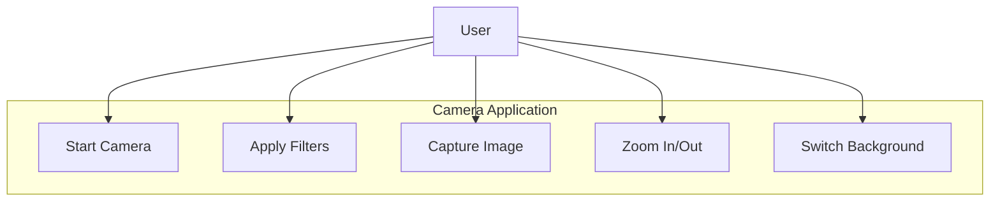

```mermaid
graph TD
    %% Actors
    user["User"]

    %% System Boundary (Camera App)
    subgraph CameraAppSystem [Camera Application]
        StartCamera["Start Camera"]
        ApplyFilters["Apply Filters"]
        CaptureImage["Capture Image"]
        ZoomInOut["Zoom In/Out"]
        SwitchBackground["Switch Background"]
    end

    %% Relationships
    user --> StartCamera
    user --> ApplyFilters
    user --> CaptureImage
    user --> ZoomInOut
    user --> SwitchBackground

```