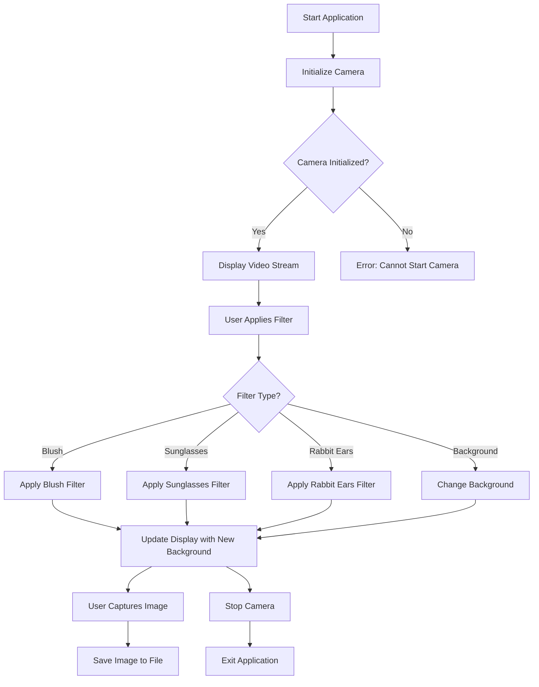

```mermaid
%% Activity Diagram for Camera Filter Application in Mermaid format

flowchart TD
    A[Start Application] --> B[Initialize Camera]
    B --> C{Camera Initialized?}
    C -- Yes --> D[Display Video Stream]
    C -- No --> E[Error: Cannot Start Camera]
    D --> F[User Applies Filter]
    
    %% Applying Filters
    F --> G{Filter Type?}
    G -- Blush --> H[Apply Blush Filter]
    G -- Sunglasses --> I[Apply Sunglasses Filter]
    G -- Rabbit Ears --> J[Apply Rabbit Ears Filter]
    G -- Background --> K[Change Background]

    H --> L[Update Display with Blush]
    I --> L[Update Display with Sunglasses]
    J --> L[Update Display with Rabbit Ears]
    K --> L[Update Display with New Background]

    %% Capture Image
    L --> M[User Captures Image]
    M --> N[Save Image to File]

    %% Ending the Process
    L --> O[Stop Camera]
    O --> P[Exit Application]
```