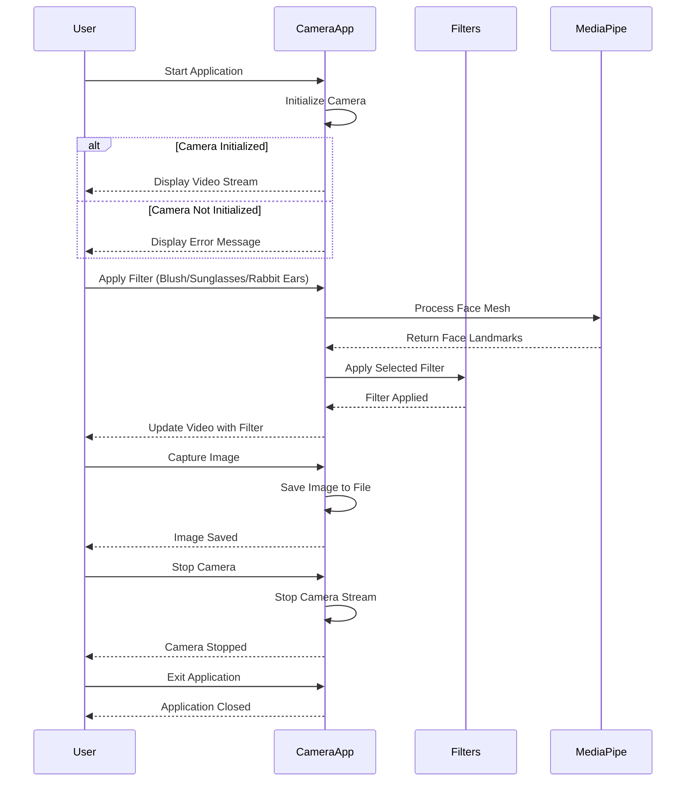

```mermaid
sequenceDiagram
    participant User
    participant CameraApp
    participant Filters
    participant MediaPipe

    %% User starts the Camera App
    User->>CameraApp: Start Application
    CameraApp->>CameraApp: Initialize Camera

    alt Camera Initialized
        CameraApp-->>User: Display Video Stream
    else Camera Not Initialized
        CameraApp-->>User: Display Error Message
    end

    %% User applies a filter
    User->>CameraApp: Apply Filter (Blush/Sunglasses/Rabbit Ears)
    CameraApp->>MediaPipe: Process Face Mesh
    MediaPipe-->>CameraApp: Return Face Landmarks

    CameraApp->>Filters: Apply Selected Filter
    Filters-->>CameraApp: Filter Applied

    CameraApp-->>User: Update Video with Filter

    %% User captures an image
    User->>CameraApp: Capture Image
    CameraApp->>CameraApp: Save Image to File
    CameraApp-->>User: Image Saved

    %% User stops the camera
    User->>CameraApp: Stop Camera
    CameraApp->>CameraApp: Stop Camera Stream
    CameraApp-->>User: Camera Stopped

    User->>CameraApp: Exit Application
    CameraApp-->>User: Application Closed


```