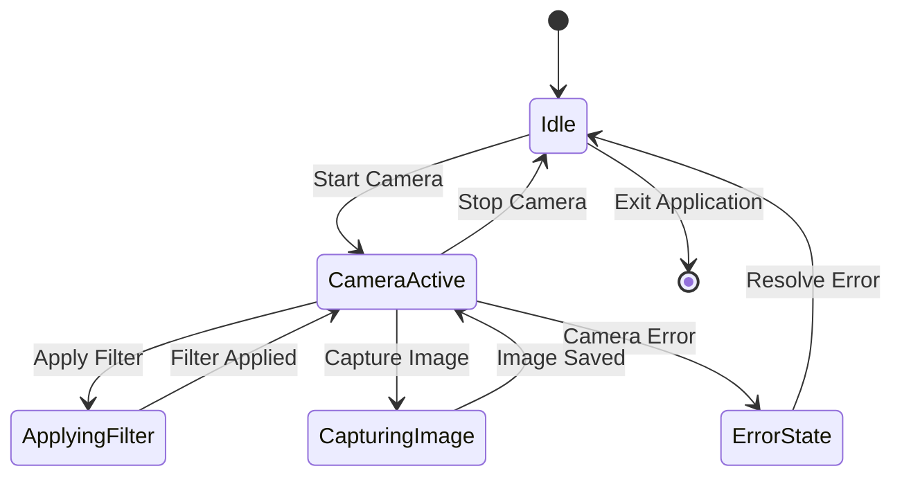

```mermaid
stateDiagram
    %% Initial State
    [*] --> Idle

    %% Idle State
    Idle --> CameraActive : Start Camera
    CameraActive --> Idle : Stop Camera

    %% CameraActive State Transitions
    CameraActive --> ApplyingFilter : Apply Filter
    CameraActive --> CapturingImage : Capture Image
    CameraActive --> ErrorState : Camera Error

    %% Applying Filters
    ApplyingFilter --> CameraActive : Filter Applied

    %% Capturing Image
    CapturingImage --> CameraActive : Image Saved

    %% Error Handling
    ErrorState --> Idle : Resolve Error

    %% Final State
    Idle --> [*] : Exit Application

```