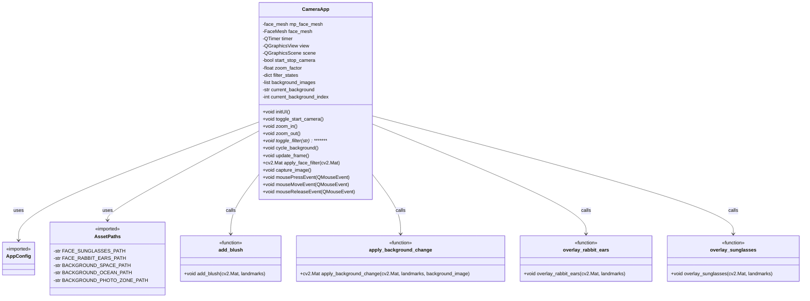

```mermaid
classDiagram
    class CameraApp {
        -face_mesh mp_face_mesh
        -FaceMesh face_mesh
        -QTimer timer
        -QGraphicsView view
        -QGraphicsScene scene
        -bool start_stop_camera
        -float zoom_factor
        -dict filter_states
        -list background_images
        -str current_background
        -int current_background_index
        +void initUI()
        +void toggle_start_camera()
        +void zoom_in()
        +void zoom_out()
        +void toggle_filter(str)********
        +void cycle_background()
        +void update_frame()
        +cv2.Mat apply_face_filter(cv2.Mat)
        +void capture_image()
        +void mousePressEvent(QMouseEvent)
        +void mouseMoveEvent(QMouseEvent)
        +void mouseReleaseEvent(QMouseEvent)
    }

    CameraApp --> AppConfig : uses
    CameraApp --> AssetPaths : uses
    CameraApp --> add_blush : calls
    CameraApp --> apply_background_change : calls
    CameraApp --> overlay_rabbit_ears : calls
    CameraApp --> overlay_sunglasses : calls

    class AppConfig {
        <<imported>>
    }

    class AssetPaths {
        <<imported>>
        -str FACE_SUNGLASSES_PATH
        -str FACE_RABBIT_EARS_PATH
        -str BACKGROUND_SPACE_PATH
        -str BACKGROUND_OCEAN_PATH
        -str BACKGROUND_PHOTO_ZONE_PATH
    }

    class add_blush {
        <<function>>
        +void add_blush(cv2.Mat, landmarks)
    }

    class apply_background_change {
        <<function>>
        +cv2.Mat apply_background_change(cv2.Mat, landmarks, background_image)
    }

    class overlay_rabbit_ears {
        <<function>>
        +void overlay_rabbit_ears(cv2.Mat, landmarks)
    }

    class overlay_sunglasses {
        <<function>>
        +void overlay_sunglasses(cv2.Mat, landmarks)
    }

```