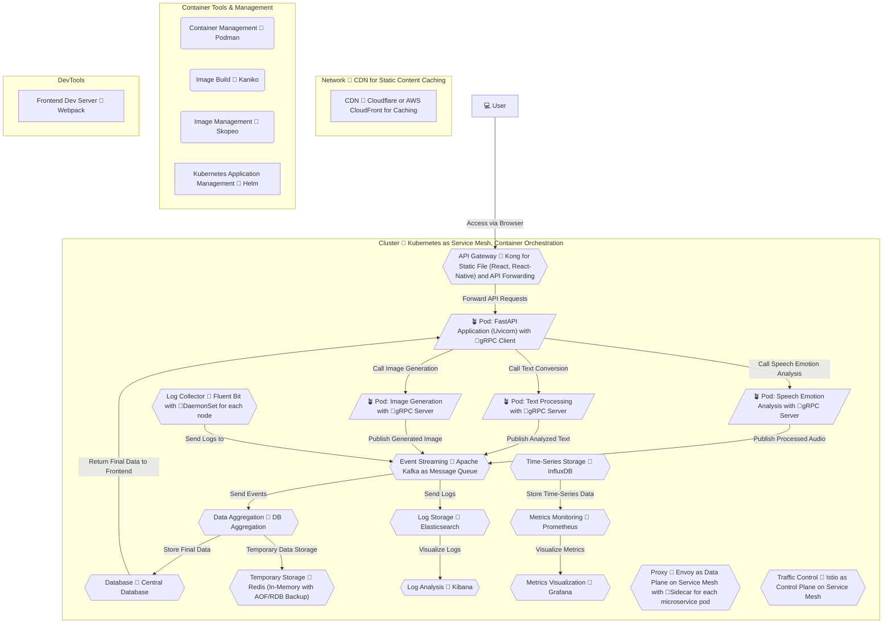

```mermaid
graph TD;

    %% Node Declarations
    A["💻 User"];
    Gateway-Kong{{"API Gateway 🔪 Kong for Static File (React, React-Native) and API Forwarding"}};
    Application-FastAPI[/"🪴 Pod: FastAPI Application (Uvicorn) with 🔗gRPC Client"/];
    Service-SpeechEmotionAnalysis[/"🪴 Pod: Speech Emotion Analysis with 🔗gRPC Server"/];
    Service-TextProcessing[/"🪴 Pod: Text Processing with 🔗gRPC Server"/];
    Service-ImageGeneration[/"🪴 Pod: Image Generation with 🔗gRPC Server"/];
    Broker-Kafka{{"Event Streaming 🔪 Apache Kafka as Message Queue"}};
    Service-DBAggregation{{"Data Aggregation 🔪 DB Aggregation"}};
    Database-CentralDB{{"Database 🔪 Central Database"}};
    Storage-Temp{{"Temporary Storage 🔪 Redis (In-Memory with AOF/RDB Backup)"}};
    LogCollector-FluentBit{{"Log Collector 🔪 Fluent Bit with 🧩DaemonSet for each node"}};
    Storage-ElasticSearch{{"Log Storage 🔪 Elasticsearch"}};
    Visualization-Kibana{{"Log Analysis 🔪 Kibana"}};
    Monitoring-Prometheus{{"Metrics Monitoring 🔪 Prometheus"}};
    Visualization-Grafana{{"Metrics Visualization 🔪 Grafana"}};
    Storage-InfluxDB{{"Time-Series Storage 🔪 InfluxDB"}};
    Envoy{{"Proxy 🔪 Envoy as Data Plane on Service Mesh with 🧩Sidecar for each microservice pod"}};
    Istio{{"Traffic Control 🔪 Istio as Control Plane on Service Mesh"}};
    CDN["CDN 🔪 Cloudflare or AWS CloudFront for Caching"];
    Podman("Container Management 🔪 Podman");
    Kaniko("Image Build 🔪 Kaniko");
    Skopeo("Image Management 🔪 Skopeo");
    Helm["Kubernetes Application Management 🔪 Helm"];
    Webpack["Frontend Dev Server 🔪 Webpack"];

    %% User actions and routes
    A -->|Access via Browser| Gateway-Kong;
    Gateway-Kong -->|Forward API Requests| Application-FastAPI;
    Application-FastAPI -->|Call Speech Emotion Analysis| Service-SpeechEmotionAnalysis;
    Application-FastAPI -->|Call Text Conversion| Service-TextProcessing;
    Application-FastAPI -->|Call Image Generation| Service-ImageGeneration;
    Service-SpeechEmotionAnalysis -->|Publish Processed Audio| Broker-Kafka;
    Service-TextProcessing -->|Publish Analyzed Text| Broker-Kafka;
    Service-ImageGeneration -->|Publish Generated Image| Broker-Kafka;
    Broker-Kafka -->|Send Events| Service-DBAggregation;
    Service-DBAggregation -->|Store Final Data| Database-CentralDB;
    Database-CentralDB -->|Return Final Data to Frontend| Application-FastAPI;
    Service-DBAggregation -->|Temporary Data Storage| Storage-Temp;
    LogCollector-FluentBit -->|Send Logs to| Broker-Kafka;
    Broker-Kafka -->|Send Logs| Storage-ElasticSearch;
    Storage-ElasticSearch -->|Visualize Logs| Visualization-Kibana;
    Monitoring-Prometheus -->|Visualize Metrics| Visualization-Grafana;
    Storage-InfluxDB -->|Store Time-Series Data| Monitoring-Prometheus;

    %% Kubernetes Cluster Subgraph
    subgraph "Cluster 🔪 Kubernetes as Service Mesh, Container Orchestration"
      Envoy;
      Istio;
      Gateway-Kong;
      Application-FastAPI;
      Service-SpeechEmotionAnalysis;
      Service-TextProcessing;
      Service-ImageGeneration;
      Service-DBAggregation;
      Storage-Temp;
      LogCollector-FluentBit;
      Broker-Kafka;
      Monitoring-Prometheus;
      Storage-ElasticSearch;
      Storage-InfluxDB;
      Database-CentralDB;
      Visualization-Grafana;
      Visualization-Kibana;
    end

    %% CDN Subgraph
    subgraph "Network 🔪 CDN for Static Content Caching"
      CDN;
    end

    %% Container Tools & Management Subgraph
    subgraph "Container Tools & Management"
      Podman;
      Kaniko;
      Skopeo;
      Helm;
    end

    %% Development Environment Subgraph
    subgraph "DevTools"
      Webpack;
    end

```

