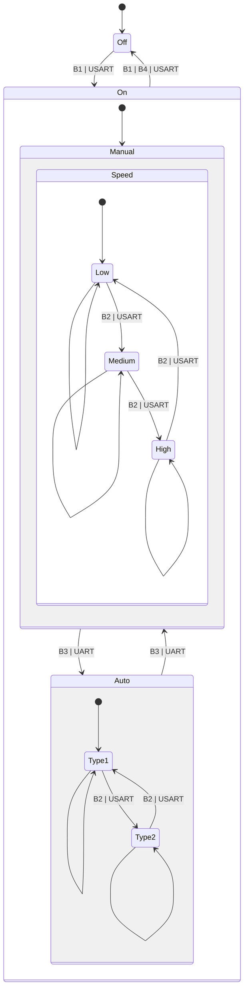

<!--
# B1: Button 1 (On | Off)
# B2: Button 2 (Speed control in either (Auto mode | Manual mode))
# B2: Button 3 ((Auto mode | Manual mode) toggle; entry point)
# B3: Button 4 (Shutdown Timer setting: None, 3 minute, 5 minute, 7 minute)

-->

